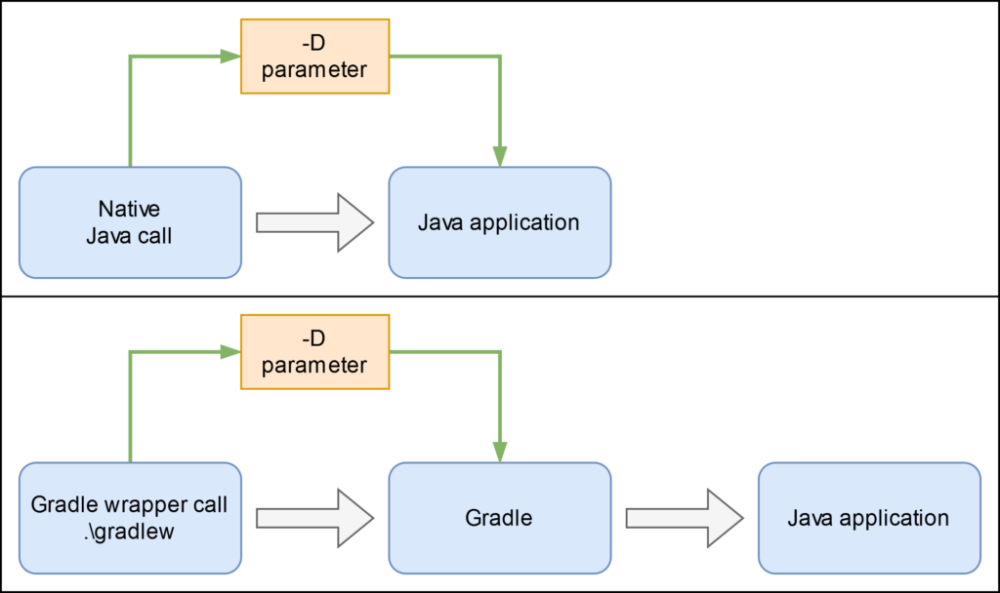
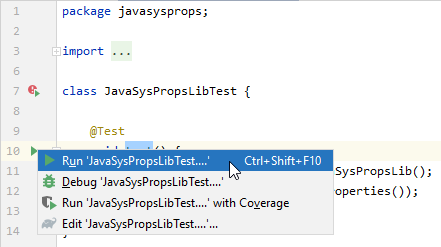
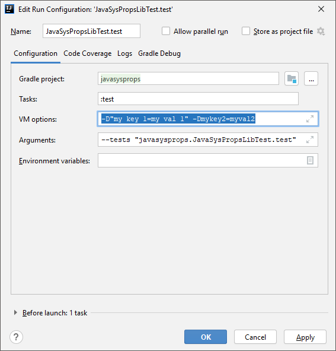
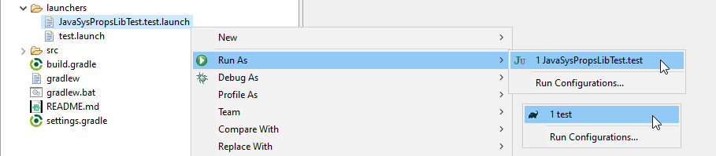
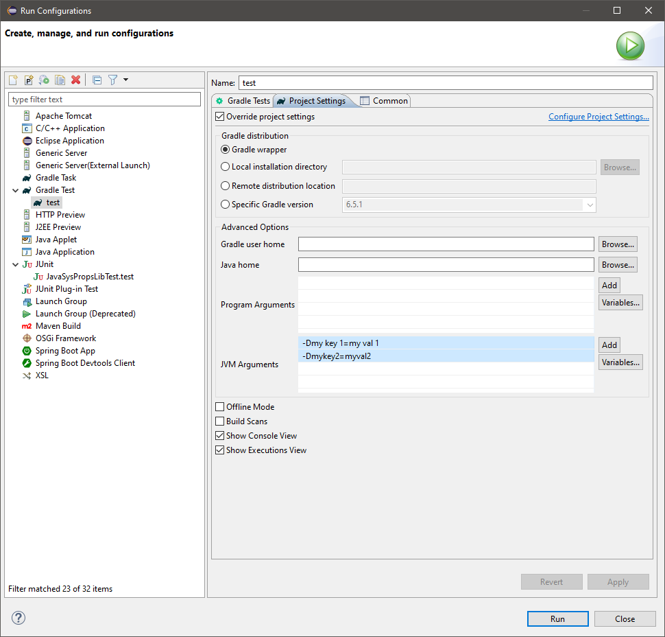
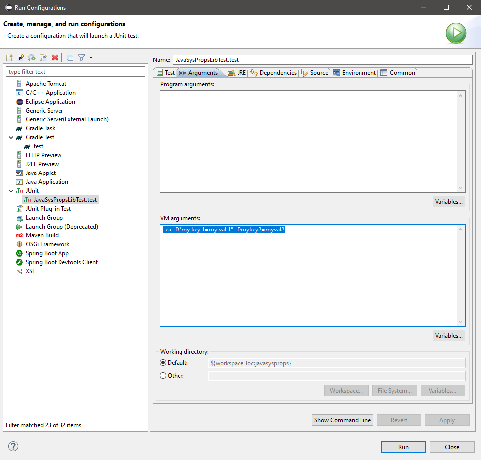

# System properties in Java
Native, with Gradle and in an IDE

The following stuff bothered me for a long time and it took some time to figure out how it works. This entry is covering the topic from plain usage in Java via command line command followed by usage in a JUnit test and finally the configuration of Eclipse and IntelliJ IDEA.

## Why?

Software should be configurable and there are several ways to achieve this. If it is not every change needs a rebuild and redeployment of the software which is unpractical from my point of view. One way to achieve the ability of configuration are system properties but usage of those, especially in JUnit tests and with usage of a build system like Gradle, can be tricky.

## Basic usage (plain Java)

One can read system properties in Java code with the following directive.

```java
System.getProperty("my key 1");
```

Here a key with spaces is used. This is a little bit more difficult than just a regular key but is not a problem. The application is then called with the following command.

```powershell
java -D"my key 1=my val 1" MyApplication
```

This works out of the box.

## In JUnit

When using this system properties in JUnit tests, things get more complicated. Here you can see a test calling a library method loading two system properties and evaluating them.

The test ...
```java
package javasysprops;

import static org.junit.jupiter.api.Assertions.assertTrue;
import org.junit.jupiter.api.Test;

class JavaSysPropsLibTest {

	@Test
	void test() {
		JavaSysPropsLib jspl = new JavaSysPropsLib();
		assertTrue(jspl.compareSystemProperties());
	}
}
```

... calls:

```java
package javasysprops;

public class JavaSysPropsLib {

	public boolean compareSystemProperties() {
		String prop1 = System.getProperty("my key 1");
		String prop2 = System.getProperty("mykey2");
		return "my val 1".equals(prop1) && "myval2".equals(prop2);
	}
}
```

This project comes with a special Gradle task, that downloads and places the JUnit standalone launcher in the directory with the generated classes:

```powershell
gradlew.bat prepareExternalTest
```

This will place the file 'junit-platform-console-standalone-1.6.2.jar' in the directory "build/classes/java". The test can then be exectued by changing into this directory ...

```powershell
cd build/classes/java
```

... and executing the following command:

```powershell
java -cp "main;test;junit-platform-console-standalone-1.6.2.jar" -D"my key 1=my val 1" -Dmykey2=myval2 org.junit.platform.console.ConsoleLauncher --select-class=javasysprops.JavaSysPropsLibTest
```
Which leads to the following output:
```
Thanks for using JUnit! Support its development at https://junit.org/sponsoring

.
+-- JUnit Jupiter [OK]
| '-- JavaSysPropsLibTest [OK]
|   '-- test() [OK]
'-- JUnit Vintage [OK]

Test run finished after 55 ms
[         3 containers found      ]
[         0 containers skipped    ]
[         3 containers started    ]
[         0 containers aborted    ]
[         3 containers successful ]
[         0 containers failed     ]
[         1 tests found           ]
[         0 tests skipped         ]
[         1 tests started         ]
[         0 tests aborted         ]
[         1 tests successful      ]
[         0 tests failed          ]
```
This gets very complicated and should only show that it can be done on the commandline.

## Usage with Gradle

When using a build system like Gradle Java is not called directly anymore and the tests are run by utilizing the “gradle” (or “gradlew”) command. One can specify “-D” parameters, but why this does not work out of the box is explained in the next diagram.



To let the test fail, comment the lines 22 and 23 in the file "build.gradle". This prevents Gradle from forwarding these parameters from commandline to executed Java VM.

```gradle
test {
    useJUnitPlatform()
    // systemProperty "my key 1", System.getProperty("my key 1")
    // systemProperty "mykey2", System.getProperty("mykey2")
}
```

```powershell
.\gradlew.bat test -D"my key 1=my val 1" -Dmykey2=myval2
> Task :test FAILED
JavaSysPropsLibTest > test() FAILED
    org.opentest4j.AssertionFailedError at JavaSysPropsLibTest.java:12
1 test completed, 1 failed
FAILURE: Build failed with an exception.
```

As soon as the lines are uncommented again, the test will succeed.

```powershell
.\gradlew.bat test -D"my key 1=my val 1" -Dmykey2=myval2

BUILD SUCCESSFUL in 1s
3 actionable tasks: 1 executed, 2 up-to-date
```

The lines that have been (un-) commented cause the property forwarding.

Now the Gradle project is correctly configured. Most of the work is done in an IDE like Eclipse or IntelliJ IDEA. There are some things to take care of to configure the mentioned tests there.

## Configure an IDE

### IntelliJ IDEA

Because the IntelliJ IDEA uses Gradle as a build system natively I will cover this IDE first. Configuration is easier there because the user can’t run two different test task types. Just open this project as Gradle project in IntelliJ and you are done.

So if the test is ran in IntellJ …



… it will fail because the parameters are not yet set.

When configured correctly (via "Edit 'JavaSysPropsLibTest....'..." in the upper screenshot) and ran again …



… the tests will be successful.

### Eclipse

To develop this project in Eclipse just import it as Gradle project. To do this you need the [Buildship plugin](https://projects.eclipse.org/projects/tools.buildship) for Eclipse.

Eclipse is a little bit more complicated because the developer can run tests either as native JUnit tests within Eclipse or as Gradle-Tests by utilizing the Buildship plugin. For both cases a launcher file is placed in the folder "launchers" in this project. These launchers are preconfigured and can be executed in Eclipse like this:



This launchers can be configured by opening the configuration dialog via the menu point "Run Configurations...":





